<div align="center">

# CopyrightFlow

### Digital Asset Licensing and Royalty Management Marketplace

CopyrightFlow is a high-fidelity React prototype for a Web3-style marketplace where creators can list digital assets, buyers can purchase or bid on licenses, and users can manage ownership, royalties, license verification, and pending settlements from one dashboard.


</div>

---

## Table of Contents

- [Overview](#overview)
- [Screenshots](#screenshots)
- [Tech Stack](#tech-stack)
- [Core Features](#core-features)
- [Application Routes](#application-routes)
- [Project Structure](#project-structure)
- [Getting Started](#getting-started)
- [Available Scripts](#available-scripts)
- [Demo Workflow](#demo-workflow)
- [Data and State Management](#data-and-state-management)
- [Deployment](#deployment)
- [Troubleshooting](#troubleshooting)
- [License](#license)

---

## Overview

CopyrightFlow simulates a creator economy platform for trading digital assets such as game art, music licenses, artwork, sound effects, and font licenses. The app focuses on the user experience of digital ownership, secondary resale royalties, escrow-style settlements, and wallet-based identity.

The project is fully client-side. Wallet connection, authentication, purchases, auctions, settlements, and royalty payouts are simulated with React state and browser `localStorage`. No backend, database, real wallet, API key, or blockchain node is required to run the application locally.

### What this project demonstrates

| Area | Description |
| --- | --- |
| Marketplace UX | Browse, filter, sort, inspect, and purchase digital asset licenses. |
| Creator workflow | Register assets, configure license type, set royalty percentage, and choose listing type. |
| Auction workflow | Place validated bids, view bid history, and simulate auction settlement. |
| Dashboard workflow | Track owned assets, royalty earnings, pending transfers, licenses, and recent activity. |
| Web3 simulation | Mock wallet connection, ownership transfers, escrow status, and royalty events. |

---

## Screenshots

### 🏠 Landing Page
*   **Hero Section & Live IP Distribution Flow Diagram:**
    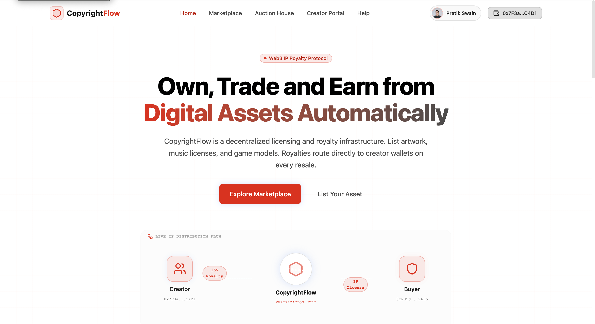
*   **Interactive Workflow steps:**
    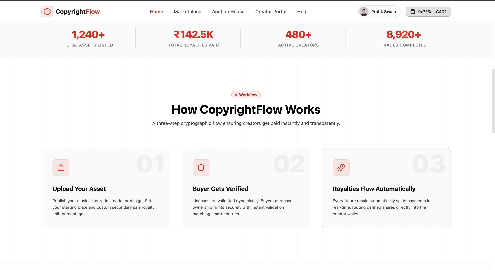
*   **Fintech Capabilities Grid:**
    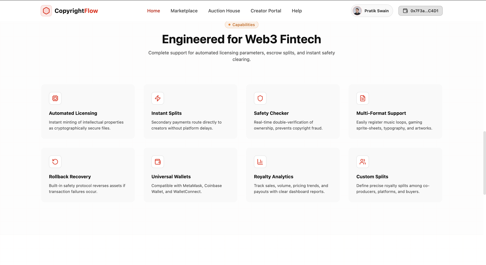
*   **Target Audience Segments & Interactive Footer:**
    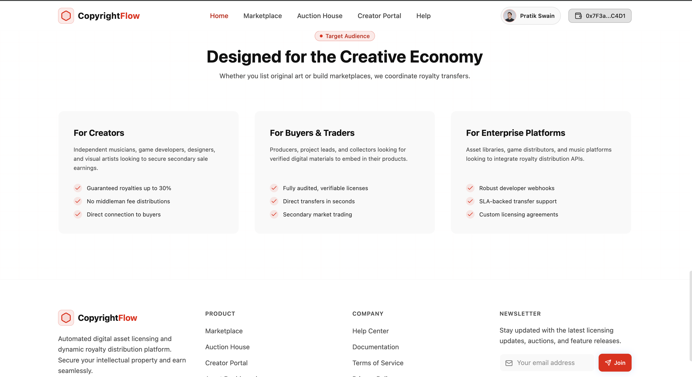

### 🛒 Marketplace & Auctions
*   **Dynamic Asset Marketplace Catalog:**
    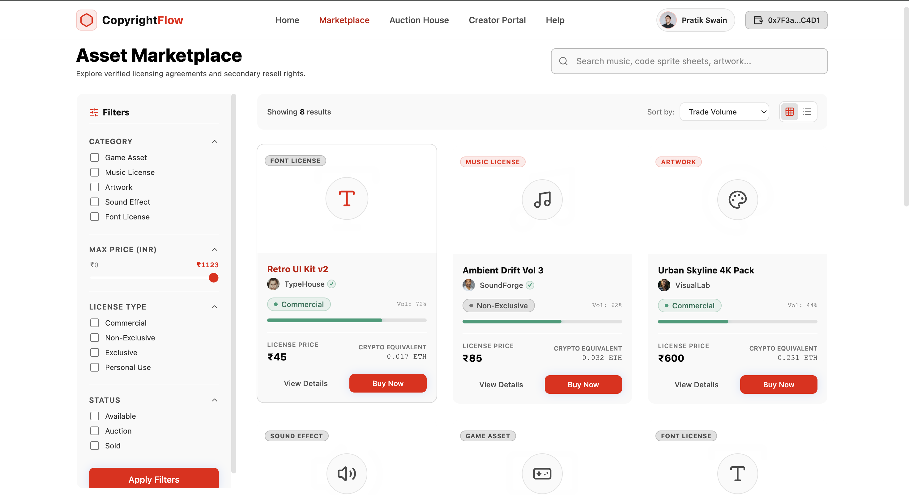
*   **Interactive Auction House Card & Bid Registry:**
    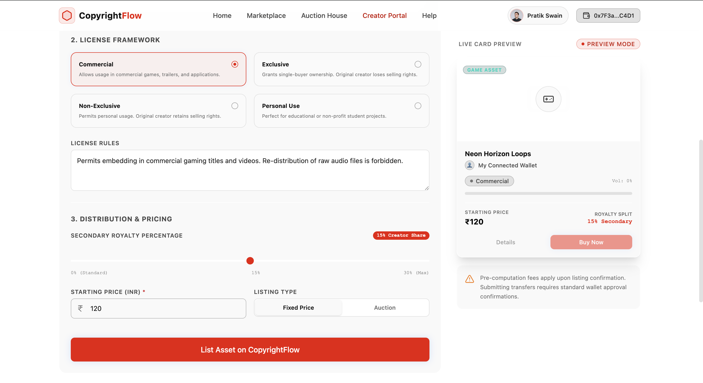

### 🎨 Creator portal
*   **Single-Screen Asset Registry Form:**
    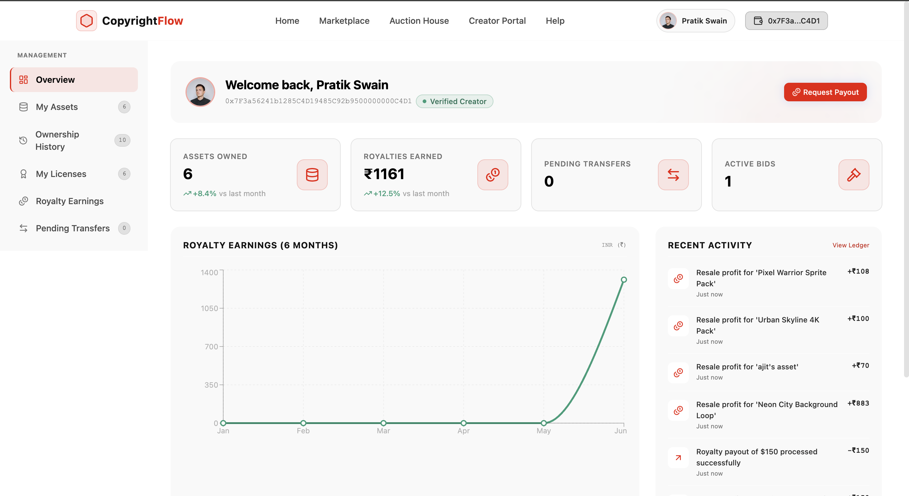
*   **Pricing, Royalty Split & Listing Type Configuration:**
    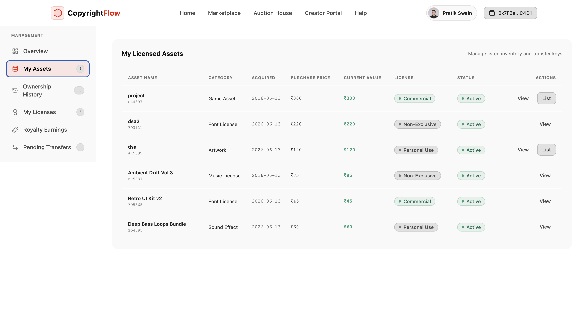

### 📊 Dashboard & Payout Analytics
*   **Overview Stats Dashboard & Monthly Earnings Charts:**
    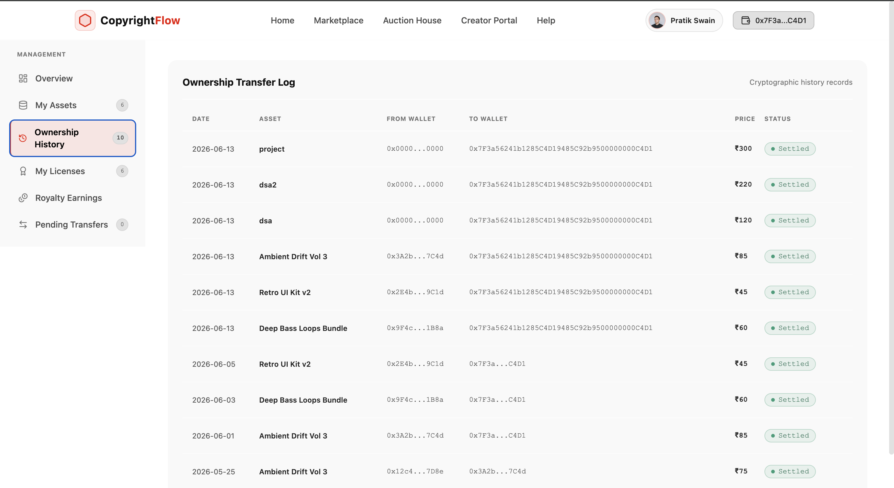
*   **Current User Owned Assets Catalog:**
    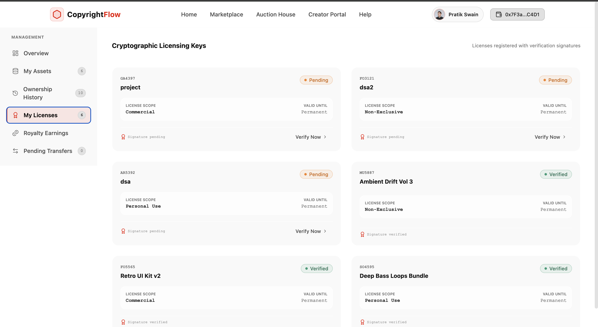
*   **Digitally Signed License Certificates:**
    
*   **Simulated Secondary Sale Royalty Ledger & Payout History:**
    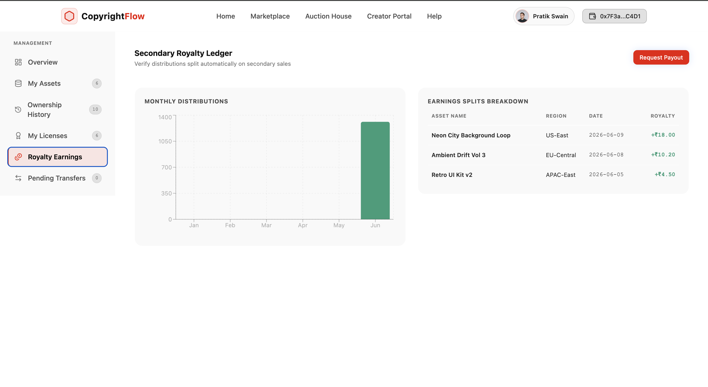
*   **Immutable Ownership and Sale Ledger Tracker:**
    
*   **Escrow-Style Pending Settlements Queue:**
    

### ❓ Documentation Center
*   **FAQ Categories & Getting Started Interactive Guides:**
    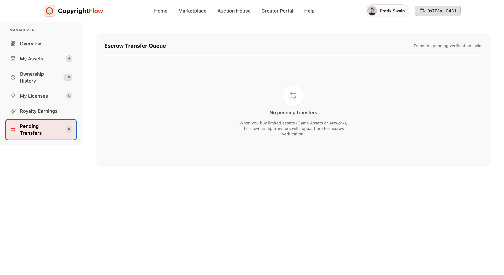

---

## Tech Stack

| Technology | Purpose |
| --- | --- |
| React 19 | Component-based UI and state-driven rendering. |
| Vite 8 | Fast local development server and production build tooling. |
| React Router DOM 6 | Client-side routing between pages. |
| Tailwind CSS 4 | Utility-first styling and theme customization. |
| Recharts | Dashboard charts and royalty analytics. |
| Lucide React | Icon system used across navigation, cards, buttons, and controls. |
| ESLint | Static analysis and code quality checks. |

---

## Core Features

### User-Facing Features

| Feature | Details |
| --- | --- |
| Landing page | Presents the protocol concept, creator benefits, royalty flow, and platform use cases. |
| Marketplace | Supports searching, category filtering, license filtering, status filtering, price filtering, sorting, and grid/list views. |
| Asset details | Displays creator information, license metadata, royalty splits, ownership history, and purchase actions. |
| Auction house | Includes countdown timers, bid validation, wallet checks, bid history, and simulated settlement. |
| Creator portal | Lets creators list assets with file selection, category, description, license type, royalty percentage, price, and listing type. |
| Wallet simulator | Simulates provider selection and verified wallet connection for MetaMask, Coinbase Wallet, and WalletConnect-style flows. |
| Dashboard | Shows user stats, royalty charts, recent activity, owned assets, licenses, transaction history, and pending transfers. |
| Help center | Provides searchable FAQ content and getting-started guides. |

### Simulation Features

| Feature | Details |
| --- | --- |
| Local persistence | Saves wallet, user, marketplace, and dashboard state in browser `localStorage`. |
| Escrow queue | Sends selected purchases into a pending settlement flow before completion. |
| Royalty tracking | Updates simulated royalty earnings after resale activity. |
| License verification | Allows license status changes from the dashboard. |
| Demo identity | Uses a mock verified user profile and wallet address for testing. |

---

## Application Routes

| Route | Page | Purpose |
| --- | --- | --- |
| `/` | Home | Landing page and product overview. |
| `/marketplace` | Marketplace | Browse and buy digital asset licenses. |
| `/assets/:id` | Asset Detail | Inspect one asset, its creator, royalty split, and history. |
| `/auctions` | Auction House | Bid on active auctions and inspect auction status. |
| `/dashboard` | Dashboard | Manage owned assets, licenses, transfers, and royalty analytics. |
| `/creator-portal` | Creator Portal | Register and list a new digital asset. |
| `/login` | Login | Simulated login flow. |
| `/register` | Register | Simulated account registration flow. |
| `/help` | Help Center | Search documentation and FAQ content. |

---

## Project Structure

```text
.
├── public/
│   ├── dashboard_mockup.png
│   ├── favicon.svg
│   └── icons.svg
├── src/
│   ├── assets/
│   │   └── hero.png
│   ├── components/
│   │   ├── layout/
│   │   ├── ui/
│   │   └── wallet/
│   ├── context/
│   │   └── AppContext.jsx
│   ├── data/
│   │   ├── assets.js
│   │   ├── auctions.js
│   │   └── dashboard.js
│   ├── hooks/
│   │   └── useCountdown.js
│   ├── pages/
│   ├── App.css
│   ├── App.jsx
│   ├── index.css
│   └── main.jsx
├── index.html
├── package.json
├── package-lock.json
├── README.md
└── vite.config.js
```

### Important Files

| File | Responsibility |
| --- | --- |
| `src/App.jsx` | Defines application routes and global overlays. |
| `src/context/AppContext.jsx` | Holds simulation logic, wallet state, user state, marketplace actions, dashboard updates, and `localStorage` sync. |
| `src/data/assets.js` | Initial marketplace asset catalog. |
| `src/data/auctions.js` | Initial auction data. |
| `src/data/dashboard.js` | Initial dashboard statistics and activity data. |
| `src/hooks/useCountdown.js` | Countdown timer logic for auction cards. |
| `src/index.css` | Tailwind CSS setup, theme tokens, and custom animations. |

---

## Getting Started

### Prerequisites

Install the following before running the project:

| Tool | Recommended Version |
| --- | --- |
| Node.js | 20 or newer |
| npm | 10 or newer |

Check your local versions:

```bash
node --version
npm --version
```

### Installation

1. Clone or download the project.

2. Open a terminal inside the project directory:

```bash
cd "react final project"
```

3. Install dependencies from the lockfile:

```bash
npm ci
```

Use this only if you intentionally want npm to update `package-lock.json`:

```bash
npm install
```

4. Start the local development server:

```bash
npm run dev
```

5. Open the local URL printed in the terminal.

Vite commonly starts at:

```text
http://localhost:5173/
```

---

## Available Scripts

| Command | Description |
| --- | --- |
| `npm run dev` | Starts the Vite development server with hot module replacement. |
| `npm run build` | Creates a production build in the `dist/` directory. |
| `npm run preview` | Serves the production build locally for verification. |
| `npm run lint` | Runs ESLint across the project. |

---

## Demo Workflow

Follow this flow to test the complete prototype:

1. Open the home page.
2. Connect a simulated wallet from the navigation.
3. Visit `/marketplace` and buy an available asset.
4. Visit `/auctions`, place a bid, and inspect the auction details.
5. Visit `/creator-portal` and create a new asset listing.
6. Return to `/marketplace` and confirm that the new listing appears.
7. Visit `/dashboard` to review owned assets, licenses, activity, royalty charts, and pending transfers.
8. Finalize or cancel pending transfers from the dashboard to test the settlement flow.

---

## Data and State Management

The app uses local seed files for its starting data and stores user activity in browser storage during the session.

| Data Source | Purpose |
| --- | --- |
| `src/data/assets.js` | Initial digital assets displayed in the marketplace. |
| `src/data/auctions.js` | Initial active auction listings. |
| `src/data/dashboard.js` | Initial dashboard stats, charts, activity, and owned asset data. |
| `src/context/AppContext.jsx` | Runtime state and action handlers for the full simulation. |

### Browser Storage Keys

| Key | Stored Data |
| --- | --- |
| `wallet` | Simulated wallet provider, connection status, and address. |
| `user` | Simulated authenticated user details. |
| `assets` | Current marketplace catalog after purchases or listings. |
| `dashboard` | User assets, licenses, transfers, stats, and activity. |

### Reset Demo Data

To reset the app back to seed data, clear site storage in the browser or run this in the browser console:

```js
localStorage.removeItem('wallet');
localStorage.removeItem('user');
localStorage.removeItem('assets');
localStorage.removeItem('dashboard');
location.reload();
```

---

## Environment Variables

No environment variables are required.

The project does not need:

- A backend server
- A database
- A real crypto wallet
- API keys
- Blockchain node access

---

## Deployment

Create a production build:

```bash
npm run build
```

Preview the build locally:

```bash
npm run preview
```

The generated `dist/` directory can be deployed to any static hosting provider, including:

- Vercel
- Netlify
- Cloudflare Pages
- GitHub Pages

---

## Troubleshooting

| Issue | Fix |
| --- | --- |
| Dependencies fail to install | Confirm Node.js and npm are installed, then rerun `npm ci`. |
| Dev server port is already in use | Use the alternate local URL printed by Vite. |
| Dashboard redirects to login | Connect a wallet or log in first. |
| Demo data looks stale | Clear the `localStorage` keys listed above and reload the page. |
| Styles do not load correctly | Reinstall dependencies with `npm ci`, then restart `npm run dev`. |

---

## License

This project is intended for educational and prototype use. Add a formal license file before publishing or distributing it as an open-source project.

## Live Demo Link

https://copyright-flow.vercel.app/
